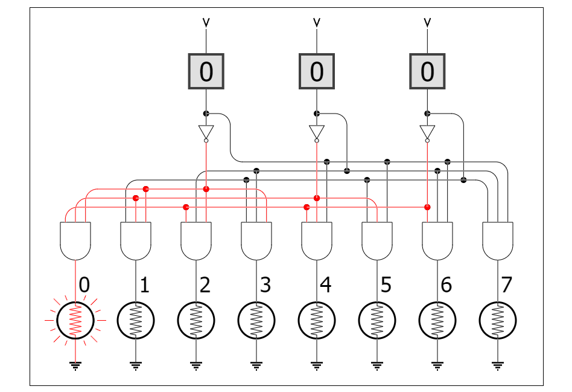
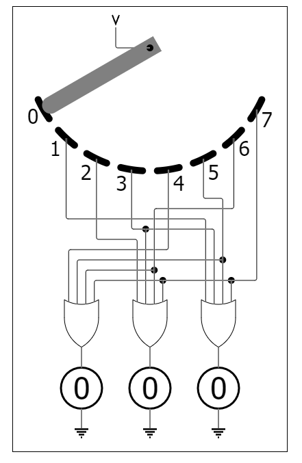

# 십진수 이외의 진법들

프로그래밍을 접하지 않았다고 하더라도 10진수 이외에 8진수, 2진수 등의 개념은 알고 있을 것이다.  
프로그래밍을 하면 흔히 10진수 외에도 16진수 8진수 2진수를 다루는데 chapter10 에서는 16진수를 제외한 진법에 대한 체계를 설명해준다.  
기본적인 내용이기에 크게 어려울 것도 없고 생략해도 무관해보인다.  
챕터의 말미에는 2진수를 8진수로 변환하는 논리 회로도와 8진수를 진수로 바꾸는 논리 회로도를 보여주는데 각각 3자리의 2진수를 8진수로 8진수를 3자리의 2진수로 변환해준다고 하여 3-8 디코더, 8-3 인코더라고 명명한다고 한다.

---

### 3-8 디코더

## 

### 8-3 인코더

# 비트, 비트, 비트

chapter11 에서는 비트의 개념을 사용한 노란 리본 이야기와 적군의 침략을 알리기 위해서 등불로 신호를 전달한 이야기로 시작한다.  
이후에는 실제로 비트를 사용한 UPC(바코드)와 QR코드를 함께 분석한다.  
크게 어려운 부분은 없으며, 공통된 부분으로는 UPC, QR 모두 전체 비트 중 많은 부분을 오류 검증에 쓰고 있다.

---

다음 장에서는 16진수와 바이트에 대한 내용을 다루는 것 같다.
