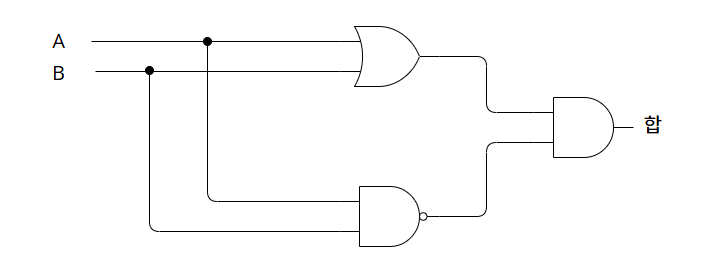
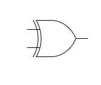
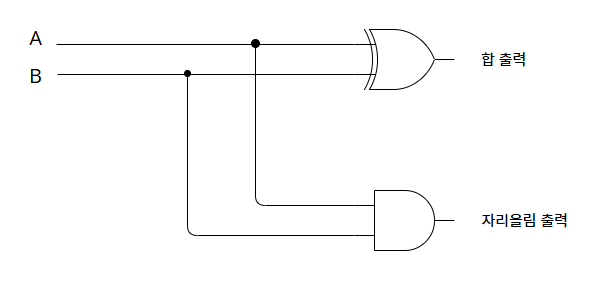
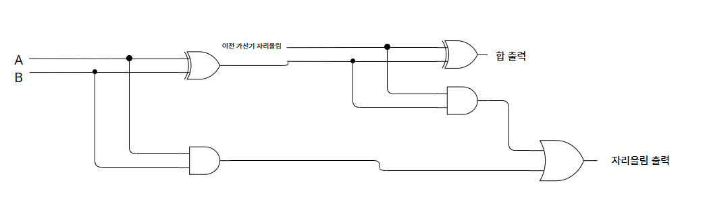

# 논리 게이트를 활용한 덧셈
2진수에서의 덧셈은 아래의 표처럼 합과 자리올림수 2가지 경우가 있다.

**- 합 -**
+ | 0 | 1
---|---|---
0|0|1
1|1|0

**- 자리올림 -**
+ | 0 | 1
---|---|---
0|0|0
1|0|1

자리올림의 경우는 AND 게이트와 동일하며,  
합의 경우에는 OR 게이트와 NAND 게이트의 출력을 AND 게이트로 묶은 경우와 동일하다.

A 입력 | B 입력 | OR 출력 | NAND 출력 | OR 출력과 NAND출력을 입력으로 받는 AND 출력
---|---|---|---|---
0|0|0|1|0
0|1|1|1|1
1|0|1|1|1
1|1|1|0|0

여기서 OR 출력과 NAND 출력을 입력으로 받는 AND 출력을 A, B입력과만 연관지어보면 합을 나타내는 표와 동일함을 알 수 있다.  
이런 형태의 출력을 갖는 게이트를 XOR(상호배재적 OR 게이트)라고 한다.  

---
두 비트를 입력으로 받아 덧셈을 하는 반가산기는 합을 계산하는 XOR 게이트와 자리올림을 계산하는 AND 게이트를 A, B 입력에 연결하여 구현한다.

**반가산기**

이렇게 완성된 반가산기를 다른 반가산기에 연결하여 자리올림 출력과 합 출력을 가지는 전가산기를 구현할 수 있다.

**전가산기**

# 실제로도 그럴까?

15장에서는 14장에서 설명한 방식대로 컴퓨터가 덧셈을 하는지를 설명한다.  
방식은 위에서 보여준 게이트들의 원리를 이용하고 있으나 실제로는 릴레이가 아닌 트랜지스터를 활용한 IC(집적회로)를 통해서 덧셈 등의 연산을 수행한다고 하는 파트이다.  

릴레이는 부품의 파손 및 기기 사이의 먼지, 벌레 등으로 오류가 나기 쉽고  
진공관은 발열이 심하여 마찬가지로 부품의 파손이 잦아 사용하기 좋지 않다.  
이런 단점을 보완할 수 있는 부품이 트랜지스터이며 릴레이, 진공관, 트랜지스터 모두 다양한 부분에서 활용될 수 있겠지만 여기서는 모두 스위치로의 역할로 생각하며 다루고 있다.